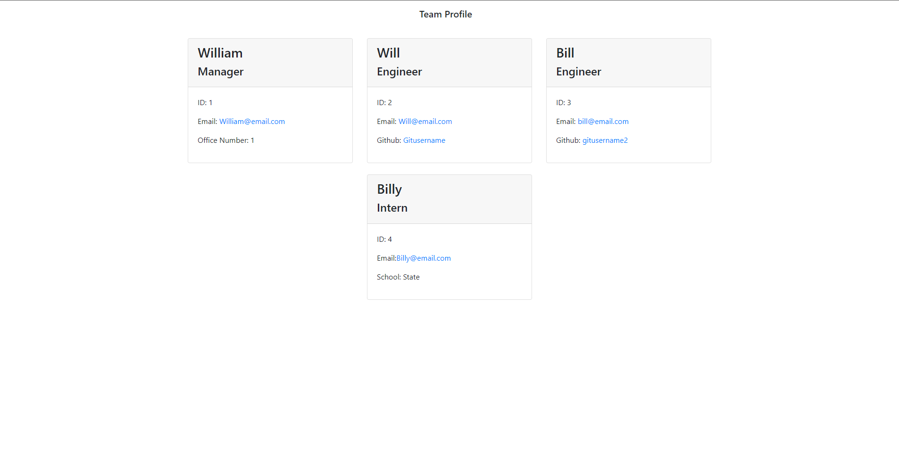

# Team Profile Generator
---
  
  ## Description 
  An application to add user input and to organize a office team.
  
  
  ## Table of Contents
  * [License](#license)
  * [Contributors](#contributors)
  * [Usage](#usage)
  * [Tests](#tests)
  * [Repo](#repo)
  * [URL](#url)
  * [Questions](#questions)
  
 
  ## License 
  This project is license under MIT

  ## Contributors
  Contributions are welcome.  To contribute contact Bill Hardgrove (contact info below)
    


  ## Usage
  To launch... type ```node index.js``` in your terminal

  ## Tests
  To run a test... type ```jest``` in your  terminal
  

  ## Repo
  The Github repo is https://github.com/WmHHardgrove/READMEgenerator

  ##  URL
  https://drive.google.com/file/d/14H2MEo3KdwHTmrDNBJaUEgpZGafLFviN/view 

  

  ## Questions
  If you have any questions about this projects, please contact me directly at Wmhhardgroveiv@gmail.com. You can view more of my projects at https://github.com/WmHHardgrove.
